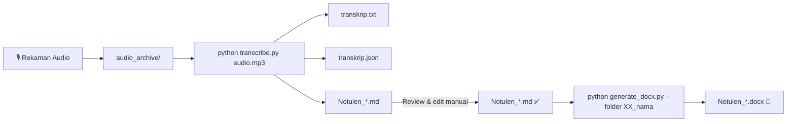

# 🎙️ Notulen Engine v2 — Mesin Transkripsi & Notulensi Otomatis

**Versi:** 2.0  
**Lokasi:** `04_notulen_enggine_v2/`  
**Dibuat:** Agustus 2026  
**Lingkungan:** Python 3.12 + Windows 11 (WDAC-enabled)

---

## 📋 Daftar Isi

1. [Deskripsi Proyek](#-deskripsi-proyek)
2. [Struktur Folder](#-struktur-folder)
3. [Spesifikasi Teknis](#-spesifikasi-teknis)
4. [Prasyarat (Prerequisites)](#-prasyarat-prerequisites)
5. [Instalasi & Setup Awal](#-instalasi--setup-awal)
6. [Tutorial: Transkripsi Audio → Notulen](#-tutorial-transkripsi-audio--notulen)
7. [Tutorial: Notulen MD → DOCX](#-tutorial-notulen-md--docx)
8. [Workflow Lengkap (End-to-End)](#-workflow-lengkap-end-to-end)
9. [Model Whisper — Perbandingan](#-model-whisper--perbandingan)
10. [FAQ & Troubleshooting](#-faq--troubleshooting)

---

## 📖 Deskripsi Proyek

**Notulen Engine v2** adalah mesin otomatis untuk:

1. **Transkripsi audio → teks** (speech-to-text)
2. **Pembuatan notulen draft** dalam format Markdown (MD)
3. **Konversi notulen MD → dokumen DOCX** profesional

Digunakan oleh tim BTD UGM untuk membuat notulensi rapat, FGD, sidang, podcast, dan kegiatan lainnya secara efisien.

### Perbedaan dari v1 (`03_notulen_enggine/`)

| Aspek | v1 | v2 |
|-------|----|----|
| Engine STT | openai-whisper (PyTorch) | faster-whisper (CTranslate2) |
| Kompatibilitas WDAC | ❌ Diblokir | ✅ Lolos |
| Output notulen | Manual | Otomatis (MD + DOCX) |
| Dependensi | torch, tiktoken | numpy saja |
| Kecepatan | Standar | Lebih cepat (int8) |

> **Alasan migrasi:** Kebijakan Windows Defender Application Control (WDAC) memblokir file DLL unsigned milik PyTorch (`torch_global_deps.dll`). v2 menggunakan CTranslate2 yang lolos WDAC.

---

## 📁 Struktur Folder

```
04_notulen_enggine_v2/
├── .venv/                        # Python virtual environment
├── audio_archive/                # Tempat menyimpan file audio sumber
├── transcribe_hasil/             # OUTPUT — hasil transkripsi & notulen
│   ├── 01_Rapat-testing-ojs/
│   ├── 02_Rapat-testing-ojs/
│   ├── 03_rapat-koordinasi-event/
│   ├── 04_Rapat-peluncuran-sistem/
│   └── 05_podcast_daily1/
├── zip_archive/                  # Arsip file zip
├── transcribe.py                 # 🎤 Mesin transkripsi (audio → TXT + JSON + MD)
├── generate_docx.py              # 📄 Konverter MD → DOCX profesional
└── requirements.txt              # Daftar dependensi Python
```

### Output per hasil transkripsi

Setiap folder di `transcribe_hasil/XX_nama/` berisi:

| File | Deskripsi |
|------|-----------|
| `transkrip.txt` | Teks transkrip utuh (plain text, line-wrapped) |
| `transkrip.json` | Metadata lengkap (segmen, timestamp, info model) |
| `Notulen_*.md` | Draft notulensi otomatis (Markdown) |
| `Notulen_*.docx` | Notulensi final format Word (setelah konversi) |

---

## 🔧 Spesifikasi Teknis

### Teknologi Inti

| Komponen | Teknologi | Versi |
|----------|-----------|-------|
| **Speech-to-Text** | faster-whisper (OpenAI Whisper via CTranslate2) | 1.2.1 |
| **Runtime ML** | CTranslate2 | 4.8.1 |
| **Audio Decode** | ffmpeg (system) + NumPy | Gyan 8.1.1 / numpy 2.5 |
| **DOCX Generator** | python-docx | 1.2.0 |
| **Python** | CPython | 3.12.10 |

### Model Whisper yang Didukung

| Model | Ukuran | VRAM | Kecepatan (relatif) | Akurasi ID |
|-------|--------|------|---------------------|------------|
| `tiny` | ~150 MB | ~1 GB | ⚡ Sangat cepat | ⭐⭐ Rendah |
| `base` | ~290 MB | ~1 GB | ⚡ Cepat | ⭐⭐⭐ Cukup |
| `small` | ~970 MB | ~2 GB | 🔵 Sedang | ⭐⭐⭐⭐ Baik |
| `medium` | ~3.1 GB | ~5 GB | 🟡 Lambat | ⭐⭐⭐⭐⭐ Sangat baik |
| `large` | ~6.2 GB | ~10 GB | 🔴 Sangat lambat | ⭐⭐⭐⭐⭐ Terbaik |

> **Rekomendasi:** `small` untuk penggunaan sehari-hari, `medium` untuk hasil terbaik.

### Workaround WDAC

Windows Defender Application Control memblokir file `.dll` dan `.pyd` yang tidak ditandatangani secara digital. Dua library yang terdampak:

1. **PyTorch** (`torch_global_deps.dll`) → Diganti dengan **CTranslate2** (faster-whisper)
2. **PyAV** (`av/*.pyd`) → Diganti dengan **ffmpeg subprocess** + NumPy manual

Solusi di `transcribe.py`:
- Pre-load fake module `av` ke `sys.modules` sebelum import faster-whisper
- Monkey-patch fungsi `decode_audio` dengan implementasi ffmpeg sendiri
- Patch diterapkan di 3 lokasi: `faster_whisper.audio`, `faster_whisper.transcribe`, `faster_whisper`

---

## 📋 Prasyarat (Prerequisites)

### 1. Python 3.10+

Pastikan Python terinstall dan tersedia di PATH.

### 2. ffmpeg (sistem)

ffmpeg digunakan untuk decode audio (menggantikan PyAV yang diblokir WDAC).

```powershell
# Install via winget (Windows 10/11)
winget install Gyan.FFmpeg.Essentials

# Verifikasi
ffmpeg -version
```

### 3. Git (opsional, untuk clone)

### 4. Koneksi Internet

Diperlukan saat **pertama kali** menjalankan transkripsi dengan model tertentu — model akan otomatis didownload dari HuggingFace (~150 MB – 6 GB tergantung model).

---

## 🚀 Instalasi & Setup Awal

### Langkah 1: Buka terminal di folder proyek

```powershell
cd "d:\SULTAN NAUFAL\KULIAH\MAGANG\MAGANG BTD\proyek\workspace\04_notulen_enggine_v2"
```

### Langkah 2: Buat virtual environment (sekali saja)

```powershell
python -m venv .venv
```

### Langkah 3: Aktifkan venv

```powershell
.venv\Scripts\Activate.ps1
```

> Bila muncul error *"running scripts is disabled"*, jalankan dulu:
> ```powershell
> Set-ExecutionPolicy -ExecutionPolicy RemoteSigned -Scope CurrentUser
> ```

### Langkah 4: Install dependensi

```powershell
pip install -r requirements.txt
```

Paket yang terinstall:
- `faster-whisper` — Mesin transkripsi
- `numpy` — Pemrosesan audio
- `python-docx` — Pembuatan dokumen Word

### Langkah 5: Verifikasi

```powershell
python -c "from faster_whisper import WhisperModel; print('OK')"
```

---

## 🎤 Tutorial: Transkripsi Audio → Notulen

### Basic usage

```powershell
# Aktifkan venv
.venv\Scripts\Activate.ps1

# Letakkan file audio di audio_archive/
# Lalu transcribe:
python transcribe.py "audio_archive/rapat_bulanan.mp3"
```

**Yang terjadi secara otomatis:**
1. Membuat folder baru `transcribe_hasil/06_rapat_bulanan/` (auto-number)
2. Download model `small` (sekali saja, ~970 MB)
3. Transkripsi audio → teks
4. Menghasilkan 3 file: `transkrip.txt`, `transkrip.json`, `Notulen_rapat_bulanan.md`

### Opsi lanjutan

```powershell
# Model lebih akurat
python transcribe.py audio.mp3 --model medium

# Bahasa Inggris
python transcribe.py audio.m4a --language en --model tiny.en

# Skip notulen MD (hanya TXT + JSON)
python transcribe.py audio.mp3 --no-md

# Output folder manual
python transcribe.py audio.mp3 --output-dir "D:\hasil_transkrip"

# Ganti compute type (default: int8)
python transcribe.py audio.mp3 --compute-type float32
```

### CLI Reference

```
usage: transcribe.py [-h] [--model MODEL] [--language LANG]
                     [--device DEVICE] [--compute-type TYPE]
                     [--output-dir DIR] [--no-md]
                     audio

positional:
  audio              Path ke file audio (mp3, wav, m4a, dll.)

options:
  --model MODEL      Model Whisper: tiny, base, small, medium, large
                     (default: small)
  --language LANG    Kode bahasa (default: id)
  --device DEVICE    cpu atau cuda (default: cpu)
  --compute-type TYPE  int8, int16, float32 (default: int8)
  --output-dir DIR   Folder output manual
  --no-md            Skip pembuatan Notulen_*.md
```

---

## 📄 Tutorial: Notulen MD → DOCX

### Basic usage

```powershell
# Konversi folder tertentu (auto-cari Notulen_*.md)
python generate_docx.py --folder 04_Rapat-peluncuran-sistem

# Konversi file MD spesifik
python generate_docx.py --md "transcribe_hasil/04_Rapat-peluncuran-sistem/Notulen_Rapat_Peluncuran_Sistem.md"

# Konversi SEMUA folder
python generate_docx.py --all

# Output custom
python generate_docx.py --md file.md --output "D:\Output\hasil.docx"
```

### Format Output DOCX

Dokumen Word yang dihasilkan memiliki:
- **Cover page** — judul, subtitle, tanggal
- **Daftar Isi** — auto-generated dari heading
- **Heading berwarna** — navy blue (#1B3A5C)

### Format Output DOCX

Dokumen Word yang dihasilkan memiliki:
- **Cover page** — judul, subtitle, tanggal
- **Daftar Isi** — auto-generated dari heading
- **Heading berwarna** — navy blue (#1B3A5C)
- **Tabel terformat** — header navy + data rows
- **Bullet & numbering** — sesuai Markdown
- **Bold / Italic** — auto-parsed dari `**bold**` dan `*italic*`
- **Font** — Calibri 10pt
- **Footer** — "— Akhir Dokumen —"

---

## 🔄 Workflow Lengkap (End-to-End)

Alur kerja ideal dari rekaman sampai dokumen final:



### Step by step

```powershell
# 1. Aktifkan venv
.venv\Scripts\Activate.ps1

# 2. Transkripsi (5-30 menit tergantung durasi audio & model)
python transcribe.py "audio_archive/rapat_koordinasi.mp3" --model small

# 3. Review & edit Notulen_rapat_koordinasi.md
#    (buka di VS Code, perbaiki kesalahan transkrip, lengkapi info)

# 4. Konversi ke DOCX
python generate_docx.py --folder 06_rapat_koordinasi

# 5. Final check DOCX di Word, lalu distribusikan
```

---

## 🤖 Model Whisper — Perbandingan

### Kapan pakai model apa?

| Situasi | Model | Alasan |
|---------|-------|--------|
| Tes cepat / cek audio | `tiny` | Cepat, cukup untuk verifikasi |
| Podcast / wawancara informal | `small` | Akurasi cukup, kecepatan baik |
| Rapat resmi / FGD / sidang | `medium` | Akurasi tinggi untuk notulen |
| Audio berisik / banyak istilah | `medium` atau `large` | Butuh akurasi maksimal |

### Estimasi waktu transkripsi (CPU i5/i7 modern)

| Durasi Audio | tiny | small | medium |
|-------------|------|-------|--------|
| 10 menit | ~30 detik | ~1 menit | ~3 menit |
| 30 menit | ~1.5 menit | ~3 menit | ~8 menit |
| 1 jam | ~3 menit | ~6 menit | ~15 menit |
| 2 jam | ~6 menit | ~12 menit | ~30 menit |

> Dengan GPU CUDA, waktu bisa 3-5× lebih cepat.

---

## ❓ FAQ & Troubleshooting

### Q: Kenapa error `ModuleNotFoundError: No module named 'docx'`?

Jalankan: `pip install python-docx`

### Q: Kenapa ada warning "unauthenticated requests to HF Hub"?

Model didownload dari HuggingFace tanpa login. Tidak berbahaya, hanya rate limit lebih rendah. Bisa diabaikan.

### Q: Kenapa ada warning symlink cache?

Windows tidak support symlink tanpa Developer Mode. File model memakai disk ~2× lebih besar (hanya sekali saat download pertama). Bisa diabaikan atau aktifkan Developer Mode.

### Q: Apakah bisa transkripsi bahasa selain Indonesia?

Ya. Gunakan `--language en` untuk Inggris, `--language ja` untuk Jepang, dll. Kode bahasa mengikuti ISO 639-1.

### Q: Bisakah pakai GPU (CUDA)?

Ya, jika laptop memiliki NVIDIA GPU dengan CUDA toolkit terinstall. Gunakan `--device cuda`.

### Q: Notulen MD hasilnya kurang akurat, kenapa?

Notulen MD dibuat dengan heuristik template (bukan AI/LLM). Kualitasnya bergantung pada kejelasan transkrip. Tips:
- Gunakan model `medium` untuk transkrip lebih bersih
- Selalu review dan edit manual file MD sebelum konversi ke DOCX
- Untuk hasil maksimal, bisa integrasikan API LLM (ChatGPT/Claude) di masa depan

### Q: Apakah v2 bisa membaca format audio yang sama dengan v1?

Ya. ffmpeg mendukung hampir semua format: MP3, WAV, M4A, AAC, OGG, FLAC, WMA, OPUS, dll.

### Q: Berapa ukuran disk yang dibutuhkan?

| Komponen | Ukuran |
|----------|--------|
| venv + packages | ~500 MB |
| Model `small` | ~970 MB (download) → ~1.8 GB (cache tanpa symlink) |
| Model `medium` | ~3.1 GB → ~6 GB |
| Per hasil transkripsi | ~100 KB – 5 MB |

### Q: Kenapa error "ffmpeg not found"?

Install ffmpeg: `winget install Gyan.FFmpeg.Essentials`, lalu restart terminal.

### Q: Apakah file audio asli dimodifikasi?

Tidak. File audio hanya dibaca (read-only), tidak diubah sama sekali.

---

## 📝 Lisensi & Kredit

Dibuat untuk keperluan internal **BTD UGM** — Program Magang 2026.

- **Whisper model:** OpenAI (open-source, MIT license)
- **faster-whisper:** Guillaume Klein (Systran, MIT license)
- **CTranslate2:** OpenNMT (MIT license)

---

*Dokumentasi terakhir diperbarui: 3 Agustus 2026*
